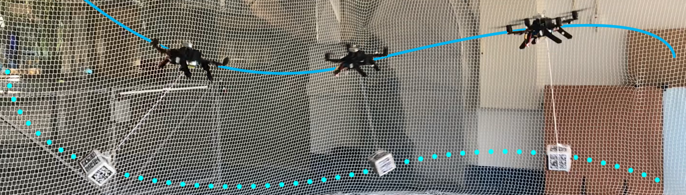

<h1>Physics-Informed Neural Network for Multirotor Slung Load Systems Modeling</h1>
<p float="left" align="center">
     
</p>
In this work, we explore the use of Physics-Informed Neural Networks (PINNs) to model the dynamics of multirotor slung load systems. We propose a novel a combination of neural network architecture + training strategy that is able to learn the dynamics of the system from a limited number of data points. We also propose a novel dataset for multirotor slung load systems, which is used to train and evaluate the proposed model.

<b>Code and dataset will be released upon publication of the associated paper.</b>

PINN-Air and the associated dataset is released under the [BSD-3 License](LICENSE).

## Citation
If you use PINN-Air or the associated dataset in your research, please cite:
```
Coming soon
```

## Developer Team
This work was developed by the following team of researchers:

* [Gil Serrano](https://github.com/GilSerrano)
* [Marcelo Jacinto](https://github.com/MarceloJacinto)
* [José Gomes](https://github.com/JoseGomesJPG)
* [João Pinto](https://github.com/jschpinto)

Supervised by:

- Prof. Rita Cunha
- Prof. Bruno Guerreiro
- Prof. Alexandre Bernardino

The authors gratefully acknowledge Chrysoula Zerva and André F. T. Martins for their suggestions to improve the quality of this work.

## Project Sponsors
- Institute for Systems and Robotics (ISR), a research unit of the Laboratory of Robotics and Engineering Systems (LARSyS)
- Instituto Superior Técnico, Universidade de Lisboa

The work developed by Gil Serrano, Marcelo Jacinto, José Gomes and João Pinto was supported by Ph.D. grants funded by Fundação para a Ciência e Tecnologia (FCT).

<p float="left" align="center">
   
   
   
</p>

<p float="left" align="center">
   
  
</p> 
