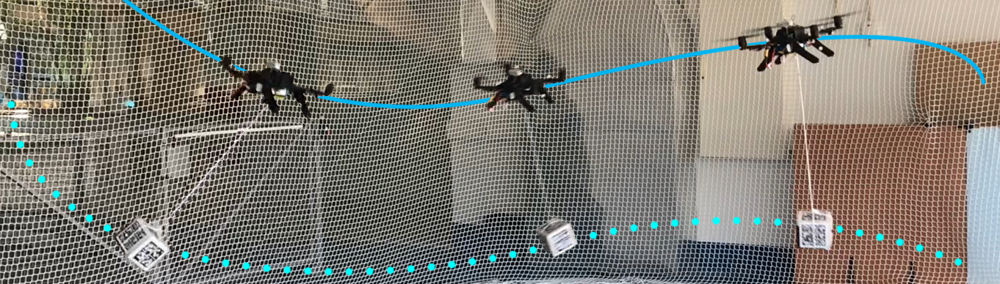
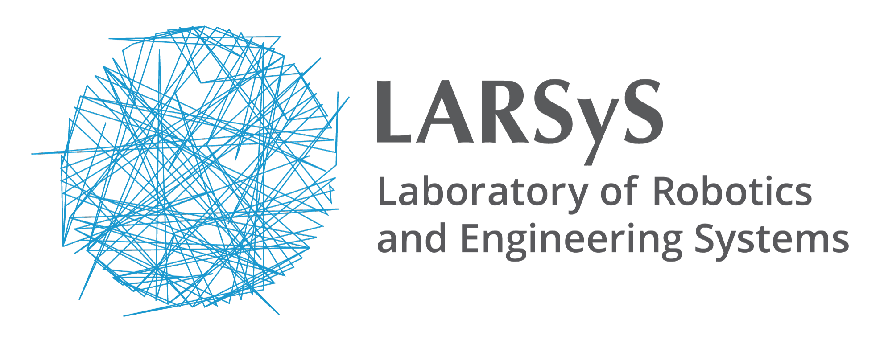

<h1>PINN-Air: Physics-Informed Neural Network for Multirotor Slung Load Systems Modeling</h1>
<p float="left" align="center">
     
</p>
In this work, we explore the use of physics-informed neural networks to learn an end-to-end model of the multirotor-slung-load system and, at a given time, estimate a sequence of the future system states. To this end, a sequence of observations of states and control inputs of the system is fed into a set of fully connected layers, which encodes the input data into a more meaningful representation. An LSTM encoder-decoder with an attention mechanism is then used to capture the dynamics of the system and another set of fully connected layers is employed to represent the decoded sequence in the original state space. To guarantee the cohesiveness between the multiple predicted states of the system and restrict the space of admissible predictions, we propose the use of a physics-based loss term in the loss function, which includes a discretized physical model derived from first principles, together with slack variables. To train the model, a dataset using a real-world quadrotor carrying a slung load was curated and is made available. Prediction results and ablations studies are presented and corroborate the feasibility of the approach. The proposed method outperforms both the first principles physical model and a comparable neural network model trained without the physics regularization proposed.

<b>Code and dataset will be released upon publication of the associated paper.</b>

PINN-Air and the associated dataset is released under the [BSD-3 License](LICENSE).

## Citation
If you use PINN-Air or the associated dataset in your research, please cite:
```
Coming soon
```

## Developer Team
This work was developed by the following team of researchers:

* [Gil Serrano](https://github.com/GilSerrano), under the supervision of <u>Prof. Bruno Guerreiro</u> and <u>Prof. Rita Cunha</u>
* [Marcelo Jacinto](https://github.com/MarceloJacinto), under the supervision of <u>Prof. Rita Cunha</u>
* [José Gomes](https://github.com/JoseGomesJPG), under the supervision of <u>Prof. Alexandre Bernardino</u>
* [João Pinto](https://github.com/jschpinto), under the supervision of <u>Prof. Bruno Guerreiro</u> and <u>Prof. Rita Cunha</u>

The authors gratefully acknowledge Chrysoula Zerva and André F. T. Martins for their suggestions to improve the quality of this work.

## Launching Tensorboard
    
```
python -m tensorboard.main --logdir "trained_models"
```
        
Then navigate to http://localhost:6006/ in your browser.

## Project Sponsors
- Institute for Systems and Robotics (ISR), a research unit of the Laboratory of Robotics and Engineering Systems (LARSyS)
- Instituto Superior Técnico, Universidade de Lisboa

The work developed by Gil Serrano, Marcelo Jacinto, José Gomes and João Pinto was supported by Ph.D. grants funded by Fundação para a Ciência e Tecnologia (FCT).

<p float="left" align="center">
   
   
   
</p>

<p float="left" align="center">
   
  
</p> 